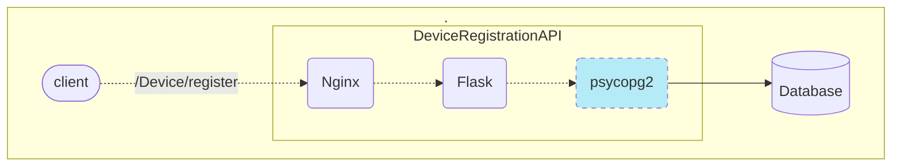
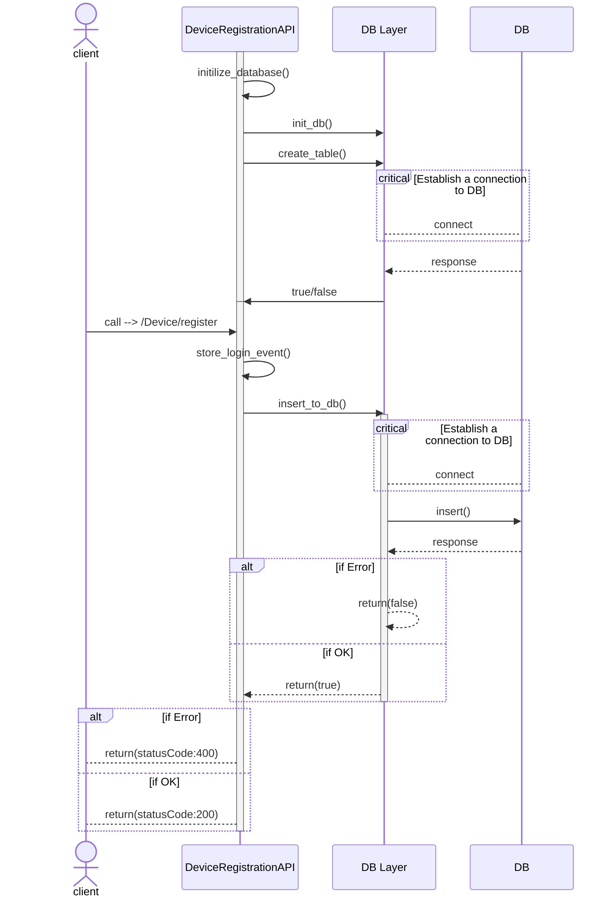

## Table of Contents
- [DeviceRegistrationAPI Micro-service](#deviceregistrationapi-micro-service)
- [Project Structure](#project-structure)
- [Technical Description/Consideration](#technical-descriptionconsideration)
  - [API Design](#api-design)
  - [Sequence Diagram](#sequence-diagram)
- [Exprimentation](#exprimentation)
  - [DataBase](#database)
  - [Build Docker image of DeviceRegistrationAPI and run it](#build-docker-image-of-deviceregistrationapi-and-run-it)
  - [Test API](#test-api)

# DeviceRegistrationAPI Micro-service
* Register a Device Type for a given User
  - Call method `POST`
  - Endpoint Path: `/Device/register`
  - Input:
    - userKey: `string`
    - deviceType: `string`
  - Output:
    - statusCode: `integer`
  - Behavior:
    - This method should:
      - Receive the input
      - Do any treatment that you think it’s ok for the entire operation
      - Do a connection to the chosen Database
      - Add the received information to the Database
  - Return:
    - If it’s ok:
      - statusCode: `200`
    - If it’s not ok:
      - statusCode: `400`

# Project Structure
This project consists of various folders and files, as shown in the following tree:

```
├── config
│   ├── flask_nginx.conf
│   ├── nginx.conf
│   ├── params.ini
│   ├── supervisord.conf
│   └── uwsgi.ini
├── Dockerfile
├── README.md
├── requirements.txt
└── src
    ├── db_layer.py
    ├── __init__.py
    ├── main.py
    ├── models
    └── wsgi.py
```

# Technical Description/Consideration
## API Design
The main components of the application are shown in this diagram:

The [**Flask**](https://flask.palletsprojects.com/en/3.0.x/) microframework is used to develop the API in Python. The [**uWSGI**](https://flask.palletsprojects.com/en/3.0.x/deploying/) application server is used to run a Flask application for production deployment, and [**Nginx**](https://www.nginx.com/) acts as a front-end reverse proxy to enforce application security. The python [**Supervisored**](http://supervisord.org/) is levereged to run two process (i.e., Flask and Nginx) inside docker.

## Sequence Diagram
This section describes the sequences diagram of `DeviceRegistrationAPI`:

`Note: Running the container image for the first time will initialize the database.`

# Exprimentation
This section describe how to run the micro service on a local machine using Docker, and then test the exposed endpoit.
## DataBase
To run the database instance, use the official image on DockerHub provided by PostgreSQL:

```bash
docker run --name cn-postgresql -e POSTGRES_PASSWORD=$DATABASE_PASSWORD -p 5002:5432 -e PGDATA=/var/lib/postgresql/data/pgdata -v /path_to_volume/:/var/lib/postgresql/data -d postgres:12.17
```

* `port:5002` is exposed to external, in order to get access to docker.
* `postgres` is the default user of the instance and `-e POSTGRES_PASSWORD=$DATABASE_PASSWORD` must be used to set a password for the given user.

## Build Docker image of DeviceRegistrationAPI and run it
In the directory `DeviceRegistrationAPI/` run the following command: 
```bash
docker build -t cn-deviceregisterapi .`, and then execute `docker run -d -t -i -e DEVICEREGISTRATION_API_TOKEN=$userKey -e DATABASE_USER=$DATABASE_USER -e DATABASE_PASSWORD=$$DATABASE_PASSWORD -e DATABASE_HOST=172.17.0.1 -e DATABASE_PORT=5002 -p 5000:80  deviceregisterapi
```

There are three ENV variables to set when running the container:
* `DEVICEREGISTRATION_API_TOKEN`: is the same as `userKey` provided by the client when sending a request to the API
* `DATABASE_USER`: database username, its default value is `postgres`
* `DATABASE_PASSWORD`: database password for the given user, here is `postgres`

## Test API
Finally, testing the API through CURL:
```bash
curl -d '{"deviceType":"IOS"}' --header "userKey: 123" -H "Content-Type: application/json" -X POST http://127.0.0.1:5000/Device/register
```

`userKey` is sent in the Http request header for authentication and `{"deviceType":"IOS"}` is data to send to the API.

`{"StatusCode": 200}` should be the response if all goes well! otherwise `{"StatusCode": 400}` 