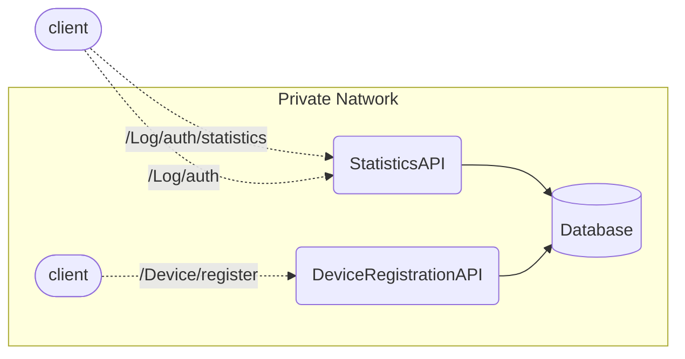
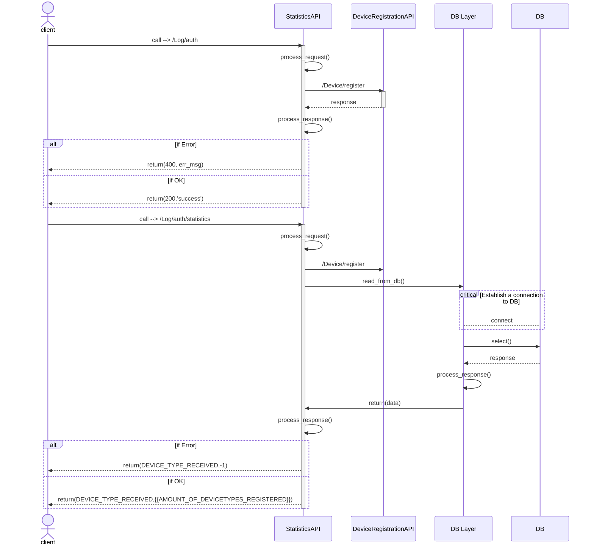
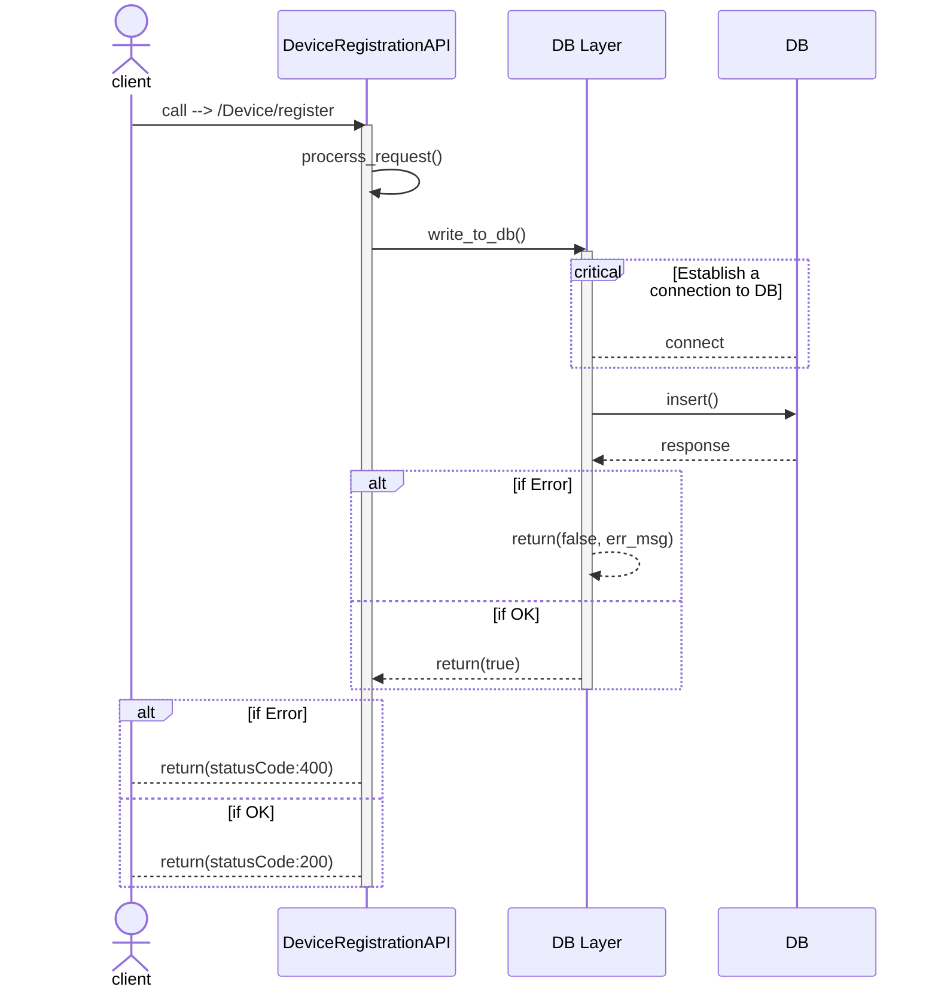
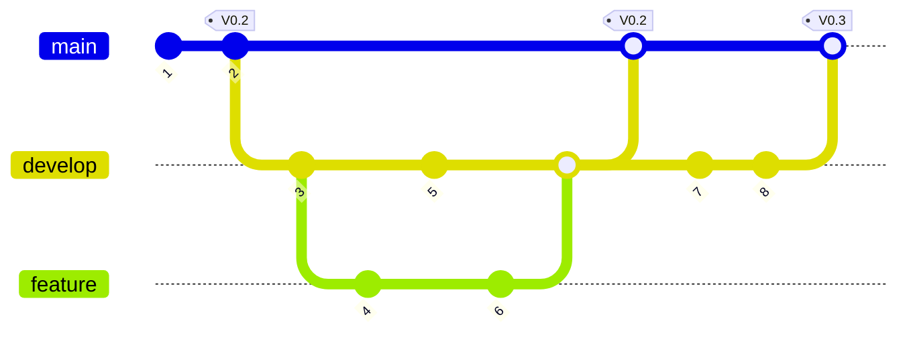

## Table of Contents
- [Project Description](#project-description)
- [Repository Structure](#repository-structure)
- [Components Technical Description/Consideration](#components-technical-descriptionconsideration)
  - [StatisticsAPI](#statisticsapi)
  - [DeviceRegistration](#deviceregistration)
- [Architecture of Application Stack](#architecture-of-application-stack)
  - [Sequence Diagram](#sequence-diagram)
- [Technical Environnement](#technical-environnement)
- [Stack Deployment](#stack-deployment)
  - [System Requirements](#system-requirements)
  - [Docker Compose](#docker-compose)
  - [Kubernetes](#kubernetes)
- [Security](#security)
  - [Security by Design](#security-by-design)
  - [Code Quality](#code-quality)
  - [Secure coding](#secure-coding)
  - [Image Security](#image-security)
  - [Software Composition Analysis](#software-composition-analysis)
  - [Static Application Security Testing (SAST)](#static-application-security-testing-sast)
- [Best Practice](#best-practice)
  - [WorkFlow Git](#workflow-git)
  - [IDE](#ide)
    - [Extensions:](#extensions)
- [Experimentation](#experimentation)
    - [Execute Docker-compose](#execute-docker-compose)
    - [Testing main endpoints](#testing-main-endpoints)
    - [Testing additional endpoints](#testing-additional-endpoints)
    - [Testing exceptions and errors](#testing-exceptions-and-errors)
    - [Testing authentication](#testing-authentication)


# Project Description
This is the hypothetical scenario we aim to address: A company operates an app across multiple platforms, and the Business Team seeks to identify the most frequently utilized platforms.

# Repository Structure
This project composed of two main folders containing code of components:
1. StatisticsAPI
2. DeviceRegistration


# Components Technical Description/Consideration
## StatisticsAPI
This application exposes two endpoints:
* Store information about user login event
  - Call method: `POST`
  - Endpoint Path `/Log/auth`
  - Input:
    - userKey: `string`
    - deviceType: `string`
  - Output:
    - statusCode: `integer`
    - message: `string`
  - Expected Behavior:
    - This method should:
      - Receive the input;
      - Do any treatment that you think it’s ok for the entire operation
      - Do a call to the DeviceRegistrationAPI, method /Device/register;
  - Return:
    - If it’s ok:
      - statusCode: `200`
      - message: `success`
    - If it’s not ok:
      - statusCode: `400`
      - message: `bad_request`

* Retrieve the amount of devices registered by type
  - Call method: `GET`
  - Endpoint Path: `/Log/auth/statistics`
  - Input:
    - deviceType: `string`
  - Output:
    - deviceType: `string`
    - count: integer

  - Expected Behavior:
    - This method should:
      - Receive the input
      - Do any treatment that you think it’s ok for the entire operation
      - Do a connection to the chosen Database
      - Retrieve the amount of devices registered given the received Device Type
  - Return:
    - If it’s ok:
      - deviceType: `{{DEVICE_TYPE_RECEIVED}}`
      - count: `{{AMOUNT_OF_DEVICETYPES_REGISTERED}}`
    - If it’s not ok:
      - deviceType: `{{DEVICE_TYPE_RECEIVED}}`
      - count: `-1`
## DeviceRegistration
* Register a Device Type for a given User
  - Call method `POST`
  - Endpoint Path: `/Device/register`
  - Input:
    - userKey: `string`
    - deviceType: `string`
  - Output:
    - statusCode: `integer`
  - Behavior:
    - This method should:
      - Receive the input
      - Do any treatment that you think it’s ok for the entire operation
      - Do a connection to the chosen Database
      - Add the received information to the Database
  - Return:
    - If it’s ok:
      - statusCode: `200`
    - If it’s not ok:
      - statusCode: `400`

# Architecture of Application Stack
Here is a schematic view of the interaction between the components of the application stack. 3 main containers are used in the implementation of the stack:
* DataBase
* StatisticsAPI
* DeviceRegistrationAPI



## Sequence Diagram
This section describes the sequences  diagram for two main components of the stack (i.e., `StatisticsAPI`, `DeviceRegistrationAPI`), and how they interact with each other and the database.




# Technical Environnement
The following table provides some detailed information on the tools and solutions used in the project:
| Item    | Technology/ Tool | Version |
| -------- | ------- | ------- |
| Programming Lanaguage  | Python    | 3.8 |
| DataBase | Postgresql     | 12.17 |
| Container    | Docker   | 24.0.05 |
| VCS           | GitHub | N/A|
| API           | Flask | 2.1.2|
| Container Deployment           | Docker-compose   | 2.2.3|

# Stack Deployment
The application stack can be run using Docker. To deploy the stack, we can use Docker Compose.

## System Requirements
* Recommended system requirements: 1GB RAM, x86 or arm64 CPU
* Minimum system requirements: 512MB RAM + swap

## Docker Compose
Docker Compose is an easy way to run the stack on a standalone machine.
* Install Docker and Docker Compose. For example, on Debian/Ubuntu `sudo apt-get install docker-compose docker.io`
* Copy `docker-compose.yml` to your machine.
* Edit the environment section of `docker-compose.yml`. See the Configuration section below.
* Finally, start docker containers using `docker-compose up -d`. The service is available on the port `5000`.

**Important ENV variables are:**
| Variable    | Description | Value |
| -------- | ------- | ------- |
| POSTGRES_DB | name of DB | safra|
| POSTGRES_USER | user of DB instance | postgres (default)|
| POSTGRES_PASSWORD | password of DB instance | postgres |
| DATABASE_USER | DB user which is used in services | POSTGRES_USER |
| DEVICEREGISTRATION_USER_KEY | userKey for auth | userKey |
| STATISTICS_USER_KEY | userKey for auth | userKey |

**Now, get access to the API:**
`http://127.0.0.1:5000/`

## Kubernetes
For deployment on a Kubernetes cluster, there are all necessary files to deploy the stack:

```
├── dep-deviceregistrationapi.yaml
├── dep-postgres.yaml
├── dep-statisticsapi.yaml
├── lb-safra.yaml
├── pv-postgres.yaml
├── secret-db.yaml
├── secret-userkey.yaml
├── svc-deviceregistrationapi.yaml
└── svc-postgres.yaml
```
`dep-deviceregistrationapi.yaml, dep-postgres.yaml, dep-statisticsapi.yaml` are Deployment and `secret-db.yaml` and `secret-userkey.yaml` are file for secrets used in the deployment, and finally `svc-deviceregistrationapi.yaml`, `svc-postgres.yaml` for services and `lb-safra.yaml` for deploying a loadbalancer in the dedicated namespace `safra`.

Here is the command to deploy full stack:
```bash
kubectl apply -f secret-db.yaml,secret-userkey.yaml,dep-postgres.yaml,dep-deviceregistrationapi.yaml,dep-statisticsapi.yaml,svc-postgres.yaml,svc-deviceregistrationapi.yaml,pv-postgres.yaml,lb-safra.yaml
```

**`Note: the order of deployment is very important`**

After a successfull deployment, we can see:
```console
mb@vm:/project/k8s-files$ kubectl get deploy
NAME                           READY   UP-TO-DATE   AVAILABLE   AGE
safra-deviceregistrationapi   1/1     1            1           34m
safra-postgres                1/1     1            1           34m
safra-statisticsapi           1/1     1            1           34m

```
and list of pods:
```console
mb@vm:/project/k8s-files$ kubectl get pods
NAME                                            READY   STATUS    RESTARTS   AGE
safra-deviceregistrationapi-56bb8cddf8-28qp6   1/1     Running   0          37m
safra-postgres-75cf8c85c-994m2                 1/1     Running   0          37m
safra-statisticsapi-74cf548f6c-mlzt6           1/1     Running   0          37m
```
**`This experimentation is done on Minikube.`**

To get access to the application from an external network(outside of Kubernetes), and in case of using **Minikube**, we need to perform some additional steps:

1)
```bash
~$ minikube tunnel
```
then run the following command, which give us the external IP and port to get access to the application:
2)
```bash
~$ minikube service -n safra lb-safra-statisticsapi
|-----------|-------------------------|-------------|-----------------------------|
| NAMESPACE |          NAME           | TARGET PORT |             URL             |
|-----------|-------------------------|-------------|-----------------------------|
| safra    | lb-safra-statisticsapi |       32000 | http://192.168.50.109:30241 |
|-----------|-------------------------|-------------|-----------------------------|
```

3) and finally:
```console
$ curl -d '{"deviceType":"Linux"}' --header "userKey: dXNlcjEyMwo" -H "Content-Type: application/json" -X POST http://192.168.50.109:30241/Log/auth
{"StatusCode": 200, "message": "success"}
```

# Security
This section provides an insight into the security aspects of the project.

## Security by Design
Securing a Flask application with Nginx is important for a number of reasons. Nginx can act as a reverse proxy, handling incoming requests, TLS and other security issues better than the WSGI server and Python itself. By using Nginx as a reverse proxy server, the Flask application is shielded from direct exposure to the external network, which can help protect it from various attacks.

## Code Quality
Code quality is a critical factor in the Software Development Life Cycle (SDLC) because it directly affects the reliability, stability and maintainability of the software. It is essential for ensuring that the software runs smoothly for longer, and reduces the time spent fixing bugs or dealing with technical debt.

We may use various tools such as Sonarlint to improve the quality of the code from the early stages of development. In this project Solarlint and Pylint are used within VScode IDE.

## Secure coding
* In software development, exception handling in an API is critical to ensuring robustness and reliability. When developing an API, exception handling is essential to providing meaningful feedback to API consumers and maintaining system stability. By properly managing exceptions, developers can prevent unexpected errors from propagating through the system, resulting in a more predictable and secure application.

In the development of this project, various errors and exceptions (database, 404, etc.) are handled carefully. Here is an example in the code:

```hs
@app.errorhandler(ThreatStackError)
def handle_errors(error):
    """ Handle errors of API in a structured way
    """
    response = jsonify(error.to_dict())
    response.status_code = error.status_code
    return response

@app.errorhandler(404)
def resource_not_found(e):
    """error handler for 404"""
    return jsonify(error="Resource not found"), 404
```

* Input validation is another aspect of API security because it helps to ensure that only properly formed data is processed. Thereby preventing various security vulnerabilities. The importance of input validation to API security lies in its ability to prevent attacks such as SQL injection, data leakage and remote code execution, which can occur when APIs process malicious or malformed data.

An example in the code of `db_layer.py` through using parameterized query:
```hs
select_query = "SELECT * FROM devices WHERE device_type=%s"
...
cursor.execute(select_query, select_key)
```

## Image Security
Docker images are scanned by [Trivy](https://trivy.dev/) to identifiy any security vulnerability:
`sudo trivy image cn-statisticsapi:v1.0.0`

5 security vulnerabilities with `level=High` are identified and finally fixed. 
```
┌─────────────────────┬────────────────┬──────────┬────────┬───────────────────┬────────────────┬──────────────────────────────────────────────────────────────┐
│       Library       │ Vulnerability  │ Severity │ Status │ Installed Version │ Fixed Version  │                            Title                             │
├─────────────────────┼────────────────┼──────────┼────────┼───────────────────┼────────────────┼──────────────────────────────────────────────────────────────┤
│ Werkzeug (METADATA) │ CVE-2023-46136 │ MEDIUM   │ fixed  │ 2.2.3             │ 3.0.1, 2.3.8   │ python-werkzeug: high resource consumption leading to denial │
│                     │                │          │        │                   │                │ of service                                                   │
│                     │                │          │        │                   │                │ https://avd.aquasec.com/nvd/cve-2023-46136                   │
├─────────────────────┼────────────────┤          │        ├───────────────────┼────────────────┼──────────────────────────────────────────────────────────────┤
│ pip (METADATA)      │ CVE-2023-5752  │          │        │ 23.0.1            │ 23.3           │ pip: Mercurial configuration injectable in repo revision     │
│                     │                │          │        │                   │                │ when installing via pip                                      │
│                     │                │          │        │                   │                │ https://avd.aquasec.com/nvd/cve-2023-5752                    │
├─────────────────────┼────────────────┤          │        ├───────────────────┼────────────────┼──────────────────────────────────────────────────────────────┤
│ requests (METADATA) │ CVE-2023-32681 │          │        │ 2.22.0            │ 2.31.0         │ python-requests: Unintended leak of Proxy-Authorization      │
│                     │                │          │        │                   │                │ header                                                       │
│                     │                │          │        │                   │                │ https://avd.aquasec.com/nvd/cve-2023-32681                   │
├─────────────────────┼────────────────┤          │        ├───────────────────┼────────────────┼──────────────────────────────────────────────────────────────┤
│ urllib3 (METADATA)  │ CVE-2023-43804 │          │        │ 1.26.5            │ 2.0.6, 1.26.17 │ python-urllib3: Cookie request header isn't stripped during  │
│                     │                │          │        │                   │                │ cross-origin redirects                                       │
│                     │                │          │        │                   │                │ https://avd.aquasec.com/nvd/cve-2023-43804                   │
│                     ├────────────────┤          │        │                   ├────────────────┼──────────────────────────────────────────────────────────────┤
│                     │ CVE-2023-45803 │          │        │                   │ 2.0.7, 1.26.18 │ urllib3: Request body not stripped after redirect from 303   │
│                     │                │          │        │                   │                │ status changes...                                            │
│                     │                │          │        │                   │                │ https://avd.aquasec.com/nvd/cve-2023-45803                   │
└─────────────────────┴────────────────┴──────────┴────────┴───────────────────┴────────────────┴──────────────────────────────────────────────────────────────┘
```

Furthermore, reducing the size of Docker images is desirable for security reasons, as it helps to reduce the attack surface and improve supply chain security. For this reason, this project uses a `lightweight` base image to Dockerize the applications.

## Software Composition Analysis
Software Composition Analysis (SCA) is an process to identify open source software in a code base. We may use for instance [OWASP Dependency-Check](https://owasp.org/www-project-dependency-check/) for this purpose.
```
dependency-check version: 9.0.8
Report Generated On: Sun, 7 Jan 2024 06:26:04 +0100
Dependencies Scanned: 0 (0 unique)
Vulnerable Dependencies: 0
Vulnerabilities Found: 0
Vulnerabilities Suppressed: 0
```
## Static Application Security Testing (SAST)
For this kind of test, we may leverage tools like SonarQube, CheckMarx, etc.
The code base of project is scenned by [**Semgrep**](https://semgrep.dev/). Nothing identified as critical by the tool. However, it suggests using SQLAlchemy as ORM to improve database security to avoid SQL injection attacks.
```hs
    DeviceRegistrationAPI/src/db_layer.py 
       python.sqlalchemy.security.sqlalchemy-execute-raw-query.sqlalchemy-execute-raw-query
          Avoiding SQL string concatenation: untrusted input concatenated with raw SQL query can     
          result in SQL Injection. In order to execute raw query safely, prepared statement should be
          used. SQLAlchemy provides TextualSQL to easily used prepared statement with named          
          parameters. For complex SQL composition, use SQL Expression Language or Schema Definition  
          Language. In most cases, SQLAlchemy ORM will be a better option.                           
          Details: https://sg.run/2b1L                                                               
                                                                                                     
          132┆ cursor.execute(create_table_query)
```
# Best Practice
## WorkFlow Git
The [Gitflow](https://www.atlassian.com/git/tutorials/comparing-workflows/gitflow-workflow) is leveraged for managing Git branches.
* `main` is the production branch
* `develop` is for developemnt and staging before merging to the `main`
* `feature` is for developping a specific feature/functionality


## IDE
[VSCode](https://code.visualstudio.com/) is used as the main IDE for developement of the project.
### Extensions:
* [Git](https://code.visualstudio.com/docs/sourcecontrol/overview) extension used as source control.
* [Pylint](https://marketplace.visualstudio.com/items?itemName=ms-python.pylint) extension used as Python linter.
* [Markdown All in One](https://marketplace.visualstudio.com/items?itemName=yzhang.markdown-all-in-one) extension is used to manage markdown page.
* [SolarLint](https://www.sonarsource.com/products/sonarlint/) an extension from SonarSource for code quaility.
* [pre-commit](https://pre-commit.com/) Git hook scripts for identifying simple issues like secret-scan before commiting code to the remote.

# Experimentation
Here is a complete end-to-end test from running the stack through `Docker-compose` to testing all endpoints and functionality of the APIs:

### Execute Docker-compose
```console
docker-compose up -d
```
The entry point to the API stack will be: `http://127.0.0.1:5000/`

### Testing main endpoints
* Testing `/Log/auth`:

```console
curl -d '{"deviceType":"IOS"}' --header "userKey: userkey123" -H "Content-Type: application/json" -X POST http://127.0.0.1:5000/Log/auth
```
Response from API:
```console
{"StatusCode": 200, "message": "success"}
```
* Testing `/Log/auth/statistics/` with a registered device `IOS`:

```console
curl -i -X GET http://127.0.0.1:5000/Log/auth/statistics/IOS
```
Response from API:
```console
{"deviceType": "IOS", "count": 3}
```

* Testing `/Log/auth/statistics/` with an **unregistered** device `IOSS`:

```console
curl -i -X GET http://127.0.0.1:5000/Log/auth/statistics/IOSS
```
Response from API:
```console
{"deviceType": "IOSs", "count": "-1"}
```

### Testing additional endpoints
* Testing root `/`:
```console
curl -i -X GET http://127.0.0.1:5000/
```
Response from API:
```console
{"INFO": "StatisticsAPI component"}
```
### Testing exceptions and errors
* Request a wrong endpoint:
```console
curl -i -X GET http://127.0.0.1:5000/Log/auth/statistic
```
Response from API:
```console
{"error":"Resource not found"}
```

* Send a wrong Json payload with a bad key `{"deviceT":"IOS"}`:
```console
curl -d '{"deviceT":"IOS"}' --header "userKey: userkey123" -H "Content-Type: application/json" -X POST http://127.0.0.1:5000/Log/auth
```
Response from API:
```console
{"message":"Invalide JSON data, Key, syntax or value."}
```
* Send a wrong Json payload with `{"deviceType":""}` null string value:
```console
curl -d '{"deviceType":""}' --header "userKey: userkey123" -H "Content-Type: application/json" -X POST http://127.0.0.1:5000/Log/auth
```
Response from API:
```console
{"message":"Invalide JSON data, Key, syntax or value."}
```
* Send a wrong Json payload with a bad type value `{"deviceType":1}`:
```console
curl -d '{"deviceType":1}' --header "userKey: userkey123" -H "Content-Type: application/json" -X POST http://127.0.0.1:5000/Log/auth
```
Response from API:
```console
{"message":"Invalide JSON data, Key, syntax or value."}
```
* Server internal error when one of the backend components like `DeviceRegistrationAPI` is unreachable:
```console
curl -d '{"deviceType":"IOS"}' --header "userKey: userkey123" -H "Content-Type: application/json" -X POST http://127.0.0.1:5000/Log/auth
```
Response from API:
```console
{"message":Error in request for storing DeviceType [IOS]}
```
### Testing authentication
* Send a wrong `userKey` in the header `--header "userKey: userkey134522"`:
```console
curl -d '{"deviceType":""}' --header "userKey: userkey134522" -H "Content-Type: application/json" -X POST http://127.0.0.1:5000/Log/auth
```
Response from API:
```console
{"ERROR": "Authentication failed", "StatusCode": "403"}
```