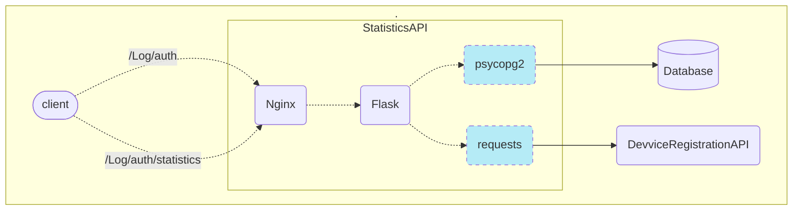
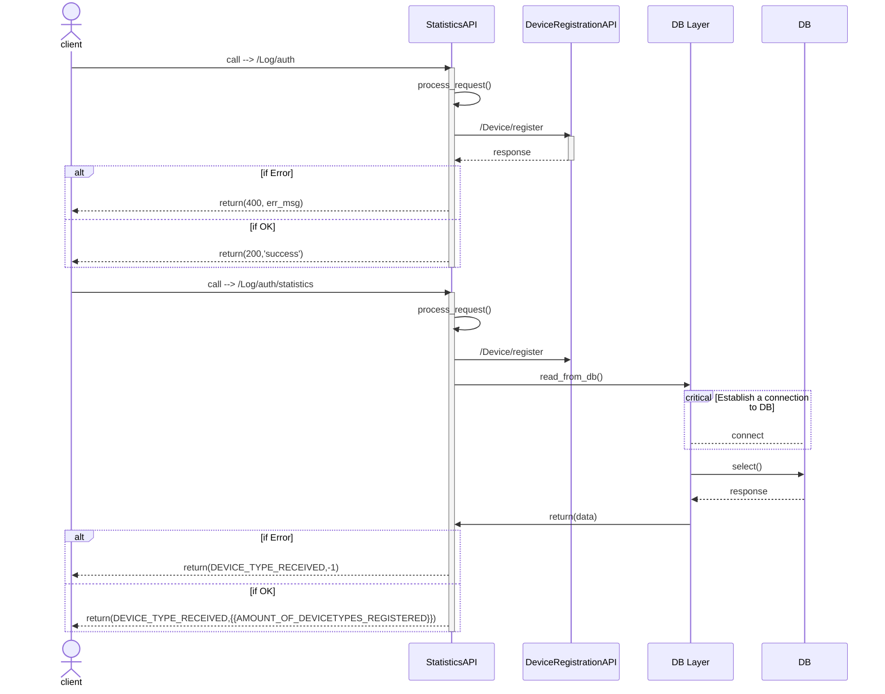

## Table of Contents
- [StatisticAPI Micro-service](#statisticapi-micro-service)
- [Project Structure](#project-structure)
- [Technical Description/Consideration](#technical-descriptionconsideration)
  - [API Design](#api-design)
  - [Sequence Diagram](#sequence-diagram)
- [Exprimentation](#exprimentation)
  - [Build Docker image of StatisticsAPI and run it](#build-docker-image-of-statisticsapi-and-run-it)
  - [Test API](#test-api)

# StatisticAPI Micro-service
This application exposes two endpoints:

* Store information about user login event
  - Call method: `POST`
  - Endpoint Path `/Log/auth`
  - Input:
    - userKey: `string`
    - deviceType: `string`
  - Output:
    - statusCode: `integer`
    - message: `string`
  - Expected Behavior:
    - This method should:
      - Receive the input;
      - Do any treatment that you think it’s ok for the entire operation
      - Do a call to the DeviceRegistrationAPI, method /Device/register;
  - Return:
    - If it’s ok:
      - statusCode: `200`
      - message: `success`
    - If it’s not ok:
      - statusCode: `400`
      - message: `bad_request`

* Retrieve the amount of devices registered by type
  - Call method: `GET`
  - Endpoint Path: `/Log/auth/statistics`
  - Input:
    - deviceType: `string`
  - Output:
    - deviceType: `string`
    - count: integer

  - Expected Behavior:
    - This method should:
      - Receive the input
      - Do any treatment that you think it’s ok for the entire operation
      - Do a connection to the chosen Database
      - Retrieve the amount of devices registered given the received Device Type
  - Return:
    - If it’s ok:
      - deviceType: `{{DEVICE_TYPE_RECEIVED}}`
      - count: `{{AMOUNT_OF_DEVICETYPES_REGISTERED}}`
    - If it’s not ok:
      - deviceType: `{{DEVICE_TYPE_RECEIVED}}`
      - count: `-1`

# Project Structure
This project consists of various folders and files, as shown in the following tree:

```
├── config
│   ├── flask_nginx.conf
│   ├── nginx.conf
│   ├── params.ini
│   ├── supervisord.conf
│   └── uwsgi.ini
├── Dockerfile
├── README.md
├── requirements.txt
└── src
    ├── db_layer.py
    ├── __init__.py
    ├── main.py
    ├── request_handler.py
    └── wsgi.py
```

# Technical Description/Consideration
## API Design
The main components of the application are shown in this diagram:

The [**Flask**](https://flask.palletsprojects.com/en/3.0.x/) microframework is used to develop the API in Python. The [**uWSGI**](https://flask.palletsprojects.com/en/3.0.x/deploying/) application server is used to run a Flask application for production deployment, and [**Nginx**](https://www.nginx.com/) acts as a front-end reverse proxy to enforce application security. The python [**Supervisored**](http://supervisord.org/) is levereged to run two process (i.e., Flask and Nginx) inside docker.

## Sequence Diagram
This section describes the sequences diagram of `StatisticsAPI`:



# Exprimentation
This section describe how to run the micro service on a local machine using Docker, and test the exposed endpoits. We consider that `postgresql` and `DeviceRegistrationAPI` are alreay running.

## Build Docker image of StatisticsAPI and run it
In the directory `StatisticsAPI/` run the following command: `docker build -t cn-statisticsapi .`, and then execute:

```console
docker run -d -t -i 
      -e STATISTICS_API_TOKEN=$userKey 
      -e DATABASE_USER=$DATABASE_USER 
      -e DATABASE_PASSWORD=$$DATABASE_PASSWORD 
      -e DATABASE_HOST=172.17.0.1 
      -e DATABASE_PORT=5002 
      -e DEVICEREGISTRATIONAPI_HOST=172.17.0.1 
      -e DEVICEREGISTRATIONAPI_PORT=5000 
      -p 5001:80  
      cn-statisticsapi:v1.0.0
```

There are five ENV variables to set when running the container:
* `DEVICEREGISTRATION_API_TOKEN`: is the same as `userKey` provided by the client when sending a request to the API
* `DATABASE_USER`: database username, its default value is `postgres`
* `DATABASE_PASSWORD`: database password for the given user, here is `postgres`
* `DEVICEREGISTRATIONAPI_HOST`: ip of `DEVICEREGISTRATIONAPI` container
* `DEVICEREGISTRATIONAPI_PORT`: port of `DEVICEREGISTRATIONAPI` container

## Test API
Testing the API through CURL:

* `/Log/auth` endpoint:
```bash
curl -d '{"deviceType":"IOS"}' --header "userKey: 123" -H "Content-Type: application/json" -X POST http://127.0.0.1:5001/Log/auth
```

`userKey` is sent in the Http request header for authentication and `{"deviceType":"IOS"}` is data to send to the API.

`{"StatusCode": 200}` should be the response if all goes well!

* `/Log/auth/statistics` endpoint:
```bash
curl -i -X GET http://127.0.0.1:5001/Log/auth/statistics/IOS
```

Here, `"IOS"` is device key to query the API.

`{"deviceType": "IOS", "count": 9}` should be the response if all goes well!, and `{"deviceType": "IOS", "count": "-1"}` if nothing found.